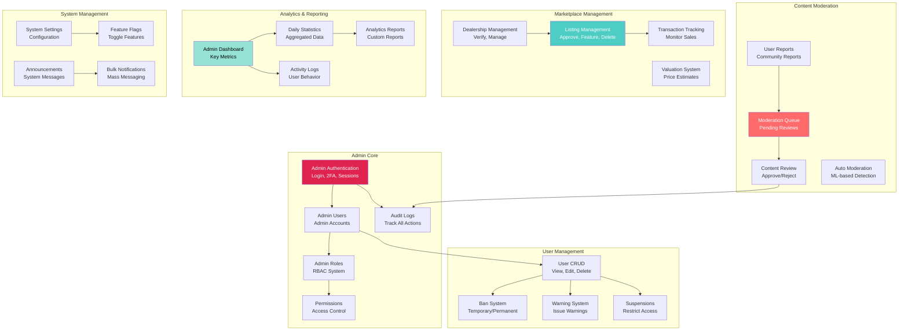
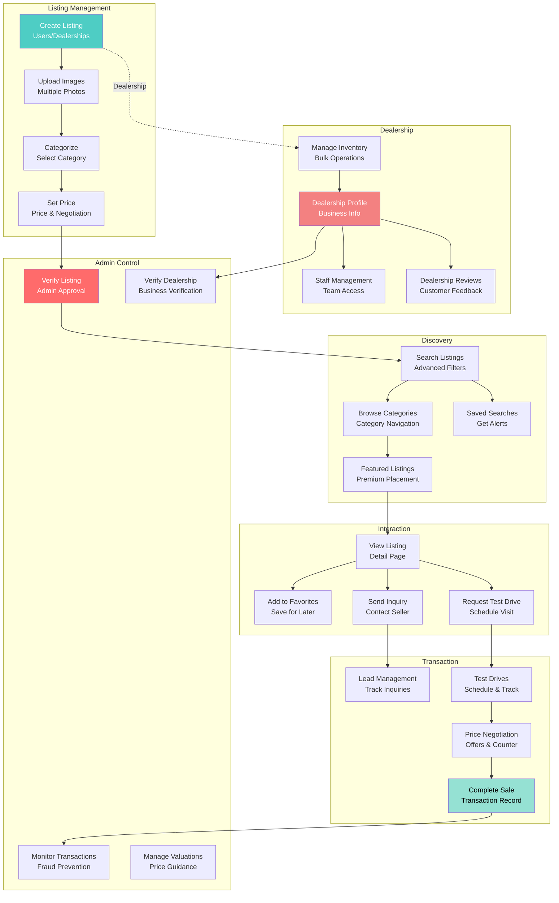
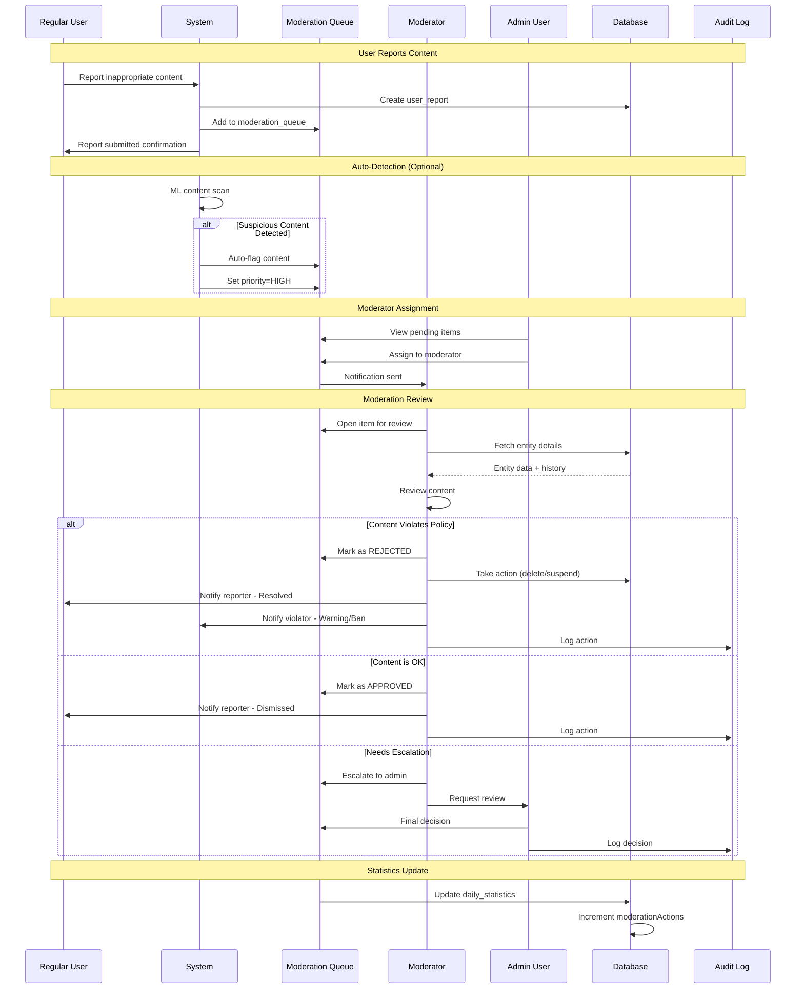
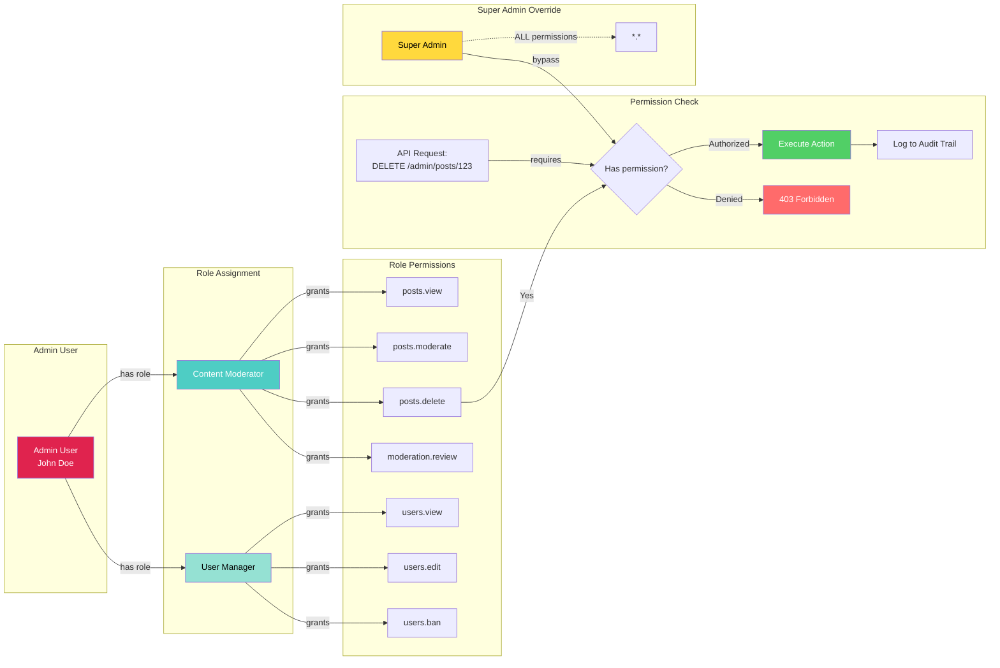
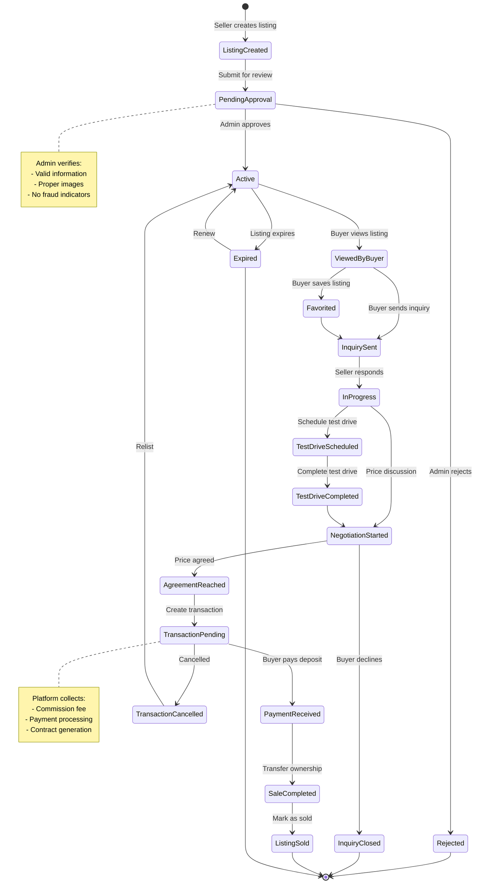
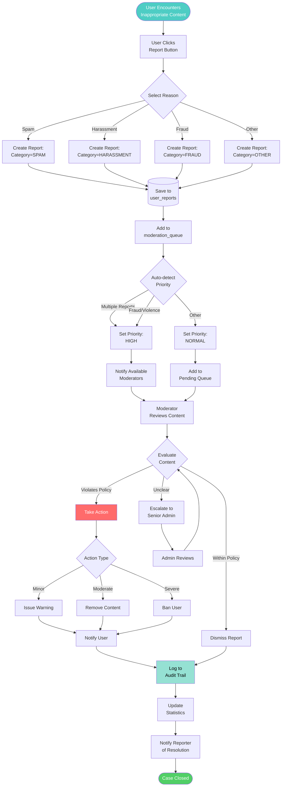

# Admin Panel - Database Diagrams

## Overview

This document contains visual diagrams for the admin panel database structure including:
1. Complete Entity Relationship Diagram (ERD)
2. Admin Module Architecture
3. Marketplace Module Architecture
4. Moderation Flow Diagram
5. Permission System Diagram

---

## 1. Complete Admin Panel ERD (All New Tables)

This diagram shows all NEW entities required for the admin panel and marketplace features.

```mermaid
erDiagram
    %% ============ ADMIN SYSTEM ============
    ADMIN_USERS ||--o{ ADMIN_AUDIT_LOGS : creates
    ADMIN_USERS ||--o{ MODERATION_QUEUE : reviews
    ADMIN_USERS ||--o{ USER_BANS : issues
    ADMIN_USERS ||--o{ USER_WARNINGS : issues
    ADMIN_USERS }o--|| ADMIN_ROLES : has

    ADMIN_ROLES ||--o{ ADMIN_USERS : contains
    ADMIN_ROLES }o--o{ ADMIN_PERMISSIONS : has

    USERS ||--o{ USER_REPORTS : creates
    USERS ||--o{ USER_BANS : receives
    USERS ||--o{ USER_WARNINGS : receives
    USERS ||--o{ USER_SUSPENSIONS : receives

    MODERATION_QUEUE }o--|| ADMIN_USERS : assigned_to
    USER_REPORTS }o--|| ADMIN_USERS : assigned_to

    %% ============ MARKETPLACE ============
    USERS ||--o{ CAR_LISTINGS : creates
    USERS ||--o{ DEALERSHIPS : owns
    USERS ||--o{ FAVORITE_LISTINGS : saves
    USERS ||--o{ SAVED_SEARCHES : creates

    DEALERSHIPS ||--o{ CAR_LISTINGS : has
    DEALERSHIPS ||--o{ DEALERSHIP_STAFF : employs
    DEALERSHIPS ||--o{ DEALERSHIP_REVIEWS : receives
    DEALERSHIPS ||--o{ TRANSACTIONS : participates

    CAR_LISTINGS ||--o{ CAR_LISTING_IMAGES : has
    CAR_LISTINGS ||--o{ INQUIRIES : receives
    CAR_LISTINGS ||--o{ TEST_DRIVES : scheduled_for
    CAR_LISTINGS ||--o{ TRANSACTIONS : involves
    CAR_LISTINGS ||--o{ FAVORITE_LISTINGS : favorited
    CAR_LISTINGS ||--o{ CAR_VALUATIONS : has
    CAR_LISTINGS }o--o{ CAR_CATEGORIES : belongs_to

    CAR_LISTING_IMAGES }o--|| FILES : references

    INQUIRIES ||--o{ TEST_DRIVES : generates
    INQUIRIES ||--o{ TRANSACTIONS : leads_to

    %% ============ ANALYTICS ============
    DAILY_STATISTICS ||--o| USERS : tracks
    USER_ACTIVITY_LOGS }o--|| USERS : logs

    %% ============ SYSTEM ============
    ADMIN_USERS ||--o{ ADMIN_ANNOUNCEMENTS : creates
    ADMIN_USERS ||--o{ BULK_NOTIFICATIONS : sends
    ADMIN_USERS ||--o{ SYSTEM_SETTINGS : updates

    %% ============ ENTITY DEFINITIONS ============

    ADMIN_USERS {
        uuid id PK
        uuid userId FK
        string email UK
        string password
        string firstName
        string lastName
        string phone
        jsonb avatar
        uuid roleId FK
        boolean isActive
        boolean isSuperAdmin
        timestamp lastLoginAt
        string lastLoginIp
        timestamp createdAt
        timestamp updatedAt
    }

    ADMIN_ROLES {
        uuid id PK
        string name
        string slug UK
        text description
        jsonb permissions
        boolean isSystemRole
        timestamp createdAt
        timestamp updatedAt
    }

    ADMIN_PERMISSIONS {
        uuid id PK
        string name
        string slug UK
        string module
        text description
        string category
        timestamp createdAt
    }

    ADMIN_AUDIT_LOGS {
        uuid id PK
        uuid adminUserId FK
        string action
        string entityType
        uuid entityId
        jsonb changes
        string ipAddress
        string userAgent
        enum result
        text errorMessage
        timestamp createdAt
    }

    MODERATION_QUEUE {
        uuid id PK
        enum entityType
        uuid entityId
        uuid reportedBy FK
        uuid assignedTo FK
        enum reason
        text description
        enum priority
        enum status
        uuid reviewedBy FK
        timestamp reviewedAt
        text reviewNotes
        enum action
        jsonb metadata
        timestamp createdAt
    }

    USER_REPORTS {
        uuid id PK
        uuid reporterId FK
        enum reportedEntityType
        uuid reportedEntityId
        uuid reportedUserId FK
        enum category
        text description
        jsonb evidence
        enum status
        uuid assignedTo FK
        text resolution
        timestamp resolvedAt
        timestamp createdAt
    }

    USER_BANS {
        uuid id PK
        uuid userId FK
        uuid bannedBy FK
        enum reason
        text description
        enum type
        timestamp startsAt
        timestamp expiresAt
        boolean isActive
        enum appealStatus
        text appealNotes
        timestamp appealedAt
        uuid reviewedBy FK
        timestamp createdAt
    }

    USER_WARNINGS {
        uuid id PK
        uuid userId FK
        uuid issuedBy FK
        enum reason
        text message
        enum severity
        timestamp acknowledgedAt
        timestamp createdAt
    }

    USER_SUSPENSIONS {
        uuid id PK
        uuid userId FK
        uuid suspendedBy FK
        text reason
        enum type
        timestamp startsAt
        timestamp expiresAt
        boolean isActive
        timestamp createdAt
    }

    CAR_LISTINGS {
        uuid id PK
        uuid userId FK
        uuid dealershipId FK
        string title
        text description
        enum status
        enum condition
        decimal price
        string currency
        boolean negotiable
        integer mileage
        integer year
        string make
        string model
        string trim
        string vin UK
        enum bodyType
        enum fuelType
        enum transmission
        enum drivetrain
        string exteriorColor
        string interiorColor
        integer doors
        integer seats
        decimal engineSize
        integer horsepower
        integer viewCount
        integer favoriteCount
        jsonb location
        jsonb features
        jsonb specifications
        boolean isVerified
        boolean isFeatured
        timestamp featuredUntil
        timestamp expiresAt
        timestamp createdAt
        timestamp updatedAt
    }

    CAR_LISTING_IMAGES {
        uuid id PK
        uuid listingId FK
        uuid fileId FK
        integer order
        boolean isPrimary
        string caption
        timestamp createdAt
    }

    CAR_CATEGORIES {
        uuid id PK
        string name
        string slug UK
        text description
        uuid parentId FK
        string icon
        integer order
        boolean isActive
        timestamp createdAt
        timestamp updatedAt
    }

    DEALERSHIPS {
        uuid id PK
        uuid ownerId FK
        string name
        string slug UK
        text description
        string email
        string phone
        string website
        jsonb logo
        jsonb coverImage
        jsonb address
        jsonb location
        jsonb businessHours
        string licenseNumber
        string taxId
        decimal rating
        integer reviewCount
        enum verificationStatus
        boolean isActive
        boolean isPremium
        timestamp premiumUntil
        integer establishedYear
        jsonb specializations
        jsonb socialMedia
        timestamp createdAt
        timestamp updatedAt
    }

    DEALERSHIP_STAFF {
        uuid id PK
        uuid dealershipId FK
        uuid userId FK
        enum role
        jsonb permissions
        boolean isActive
        timestamp hiredAt
        timestamp createdAt
    }

    DEALERSHIP_REVIEWS {
        uuid id PK
        uuid dealershipId FK
        uuid userId FK
        uuid listingId FK
        integer rating
        text content
        text answer
        timestamp answeredAt
        jsonb images
        boolean isVerified
        timestamp createdAt
        timestamp updatedAt
    }

    INQUIRIES {
        uuid id PK
        uuid listingId FK
        uuid buyerId FK
        uuid sellerId FK
        uuid dealershipId FK
        enum type
        text message
        enum status
        enum priority
        uuid assignedTo FK
        timestamp createdAt
        timestamp updatedAt
        timestamp closedAt
    }

    TEST_DRIVES {
        uuid id PK
        uuid inquiryId FK
        uuid listingId FK
        uuid customerId FK
        uuid dealershipId FK
        timestamp scheduledAt
        integer duration
        jsonb location
        enum status
        text notes
        uuid confirmedBy FK
        timestamp completedAt
        timestamp createdAt
    }

    TRANSACTIONS {
        uuid id PK
        uuid listingId FK
        uuid buyerId FK
        uuid sellerId FK
        uuid dealershipId FK
        uuid inquiryId FK
        enum type
        enum status
        decimal amount
        string currency
        enum paymentMethod
        enum paymentStatus
        decimal commissionAmount
        enum commissionStatus
        text notes
        string contractUrl
        jsonb metadata
        timestamp createdAt
        timestamp completedAt
    }

    FAVORITE_LISTINGS {
        uuid id PK
        uuid userId FK
        uuid listingId FK
        text notes
        timestamp createdAt
    }

    SAVED_SEARCHES {
        uuid id PK
        uuid userId FK
        string name
        jsonb filters
        boolean notifyOnNew
        timestamp createdAt
        timestamp updatedAt
    }

    CAR_VALUATIONS {
        uuid id PK
        uuid listingId FK
        uuid userId FK
        string make
        string model
        integer year
        integer mileage
        enum condition
        decimal estimatedValue
        jsonb valuationRange
        jsonb marketData
        enum source
        uuid createdBy FK
        timestamp createdAt
        timestamp expiresAt
    }

    DAILY_STATISTICS {
        uuid id PK
        date date UK
        integer newUsers
        integer activeUsers
        integer newPosts
        integer newListings
        integer newTransactions
        integer newDealerships
        decimal totalRevenue
        integer moderationActions
        integer reportedItems
        jsonb metadata
        timestamp createdAt
    }

    USER_ACTIVITY_LOGS {
        uuid id PK
        uuid userId FK
        string action
        string entityType
        uuid entityId
        jsonb metadata
        string ipAddress
        string userAgent
        timestamp createdAt
    }

    SYSTEM_SETTINGS {
        uuid id PK
        string key UK
        jsonb value
        string category
        text description
        boolean isPublic
        uuid updatedBy FK
        timestamp createdAt
        timestamp updatedAt
    }

    FEATURE_FLAGS {
        uuid id PK
        string name
        string slug UK
        boolean isEnabled
        text description
        integer rolloutPercentage
        jsonb userSegments
        timestamp createdAt
        timestamp updatedAt
    }

    ADMIN_ANNOUNCEMENTS {
        uuid id PK
        string title
        text content
        enum type
        enum priority
        enum targetAudience
        jsonb userSegment
        enum status
        timestamp scheduledAt
        timestamp publishedAt
        timestamp expiresAt
        uuid createdBy FK
        jsonb style
        timestamp createdAt
    }

    BULK_NOTIFICATIONS {
        uuid id PK
        uuid createdBy FK
        string title
        text message
        enum type
        jsonb targetUsers
        integer totalRecipients
        integer sentCount
        integer failedCount
        enum status
        timestamp scheduledAt
        timestamp completedAt
        timestamp createdAt
    }
```

---

## 2. Admin Module Architecture

This diagram shows how admin modules are organized and their relationships.

---

## 3. Marketplace Architecture

This diagram shows the complete marketplace module structure.

---

## 4. Moderation Flow Sequence

This diagram shows the complete moderation workflow from report to resolution.

---

## 5. Admin Permission System Architecture

This diagram shows how the RBAC (Role-Based Access Control) system works.

---

## 6. Transaction Lifecycle Diagram

This diagram shows the complete flow from listing view to completed sale.

---

## 7. Admin Dashboard Metrics Overview

This diagram shows the key metrics displayed on the admin dashboard.

```mermaid
graph TB
    subgraph "User Metrics"
        TotalUsers[Total Users<br/>150,432]
        NewUsers[New Today<br/>+234]
        ActiveUsers[Active Today<br/>12,453]
        BannedUsers[Banned Users<br/>342]
    end

    subgraph "Content Metrics"
        TotalPosts[Total Posts<br/>45,234]
        TotalListings[Total Listings<br/>8,932]
        PendingMod[Pending Moderation<br/>67]
        RemovedContent[Removed Today<br/>23]
    end

    subgraph "Marketplace Metrics"
        ActiveListings[Active Listings<br/>7,821]
        SoldToday[Sold Today<br/>45]
        RevenueToday[Revenue Today<br/>₽2,345,000]
        AvgPrice[Avg Price<br/>₽1,850,000]
    end

    subgraph "Moderation Metrics"
        OpenReports[Open Reports<br/>34]
        ResolvedToday[Resolved Today<br/>89]
        AvgResponseTime[Avg Response<br/>2.3 hours]
        ModQueue[Queue Size<br/>67]
    end

    subgraph "Dealership Metrics"
        TotalDealers[Total Dealerships<br/>432]
        VerifiedDealers[Verified<br/>387]
        PendingVerif[Pending<br/>45]
        DealerRevenue[Dealer Revenue<br/>₽1,234,000]
    end

    subgraph "System Health"
        APIStatus[API Status<br/>✓ Healthy]
        DBStatus[Database<br/>✓ Healthy]
        StorageUsed[Storage Used<br/>834 GB / 2 TB]
        ErrorRate[Error Rate<br/>0.02%]
    end

    Dashboard[Admin Dashboard]

    Dashboard --> TotalUsers
    Dashboard --> TotalPosts
    Dashboard --> ActiveListings
    Dashboard --> OpenReports
    Dashboard --> TotalDealers
    Dashboard --> APIStatus

    style Dashboard fill:#e0234e,color:#fff
    style TotalUsers fill:#4ecdc4,color:#fff
    style TotalListings fill:#95e1d3,color:#000
    style OpenReports fill:#ff6b6b,color:#fff
    style RevenueToday fill:#51cf66,color:#fff
```

---

## 8. Data Flow: From User Report to Resolution

---

## Summary

These diagrams provide a complete visual overview of:

1. **Complete ERD** - All 25 new database tables with relationships
2. **Admin Module Architecture** - How admin features are organized
3. **Marketplace Architecture** - Complete marketplace flow
4. **Moderation Flow** - Step-by-step moderation process
5. **Permission System** - RBAC implementation
6. **Transaction Lifecycle** - From listing to sale
7. **Dashboard Metrics** - Key performance indicators
8. **Report Resolution Flow** - Complete moderation workflow

### Key Relationships:
- Admin users have roles → Roles have permissions
- Content generates reports → Reports enter moderation queue
- Listings belong to users OR dealerships
- Transactions link buyers, sellers, listings, and inquiries
- Everything is tracked in audit logs
