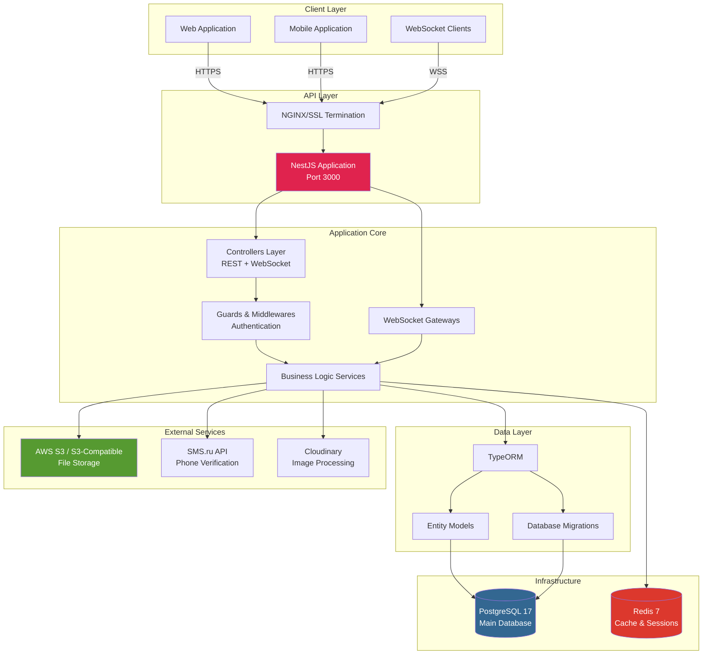
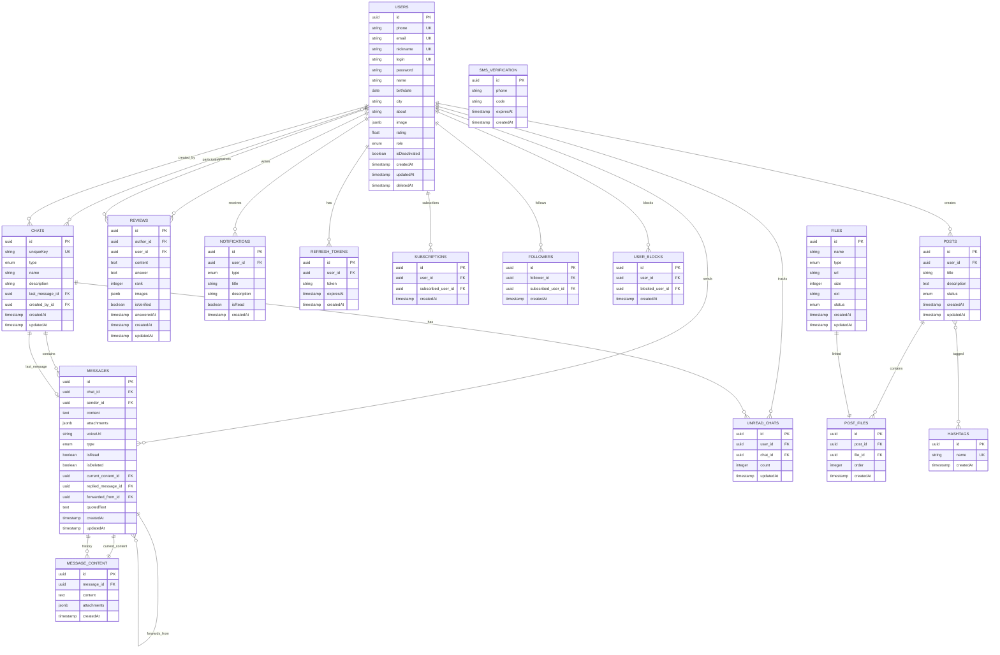
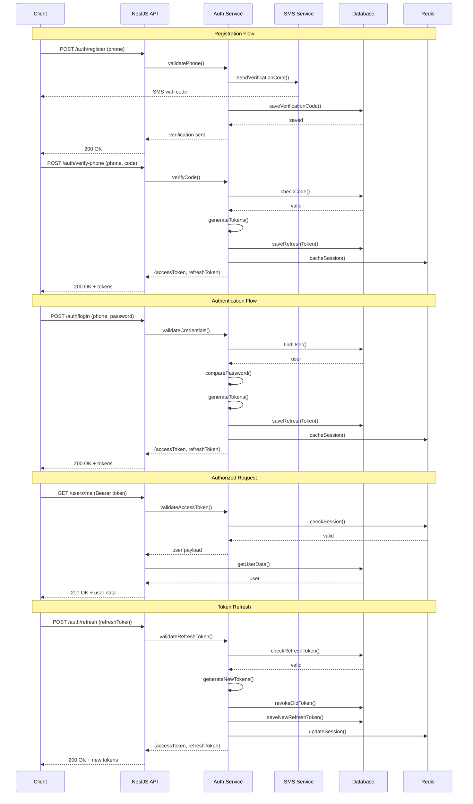
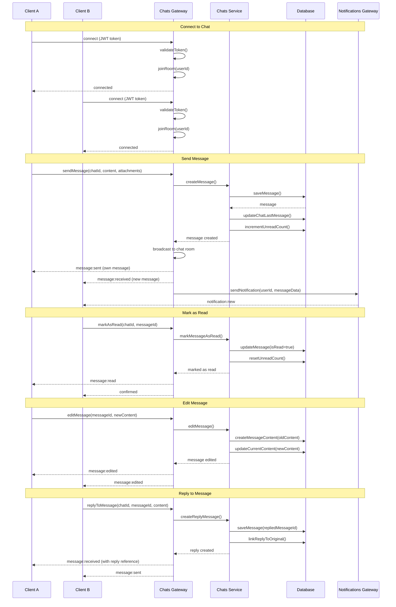
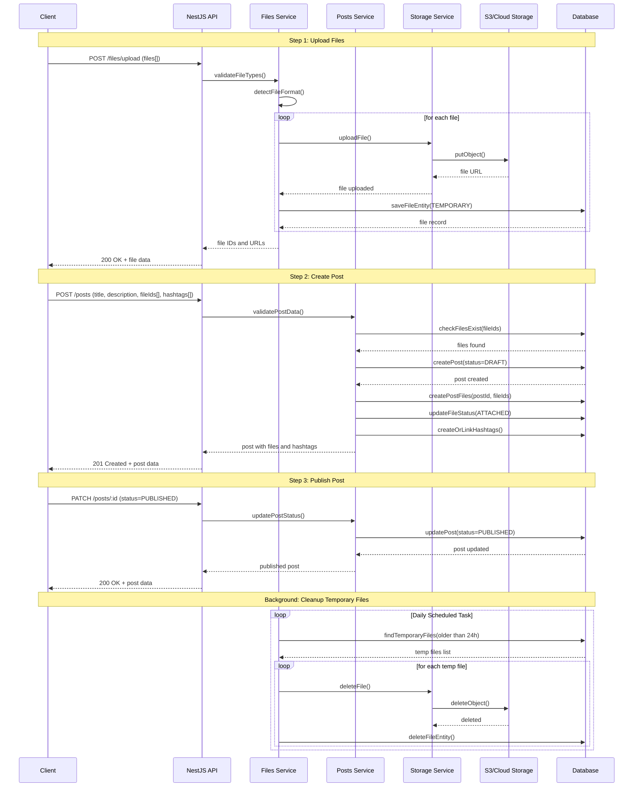
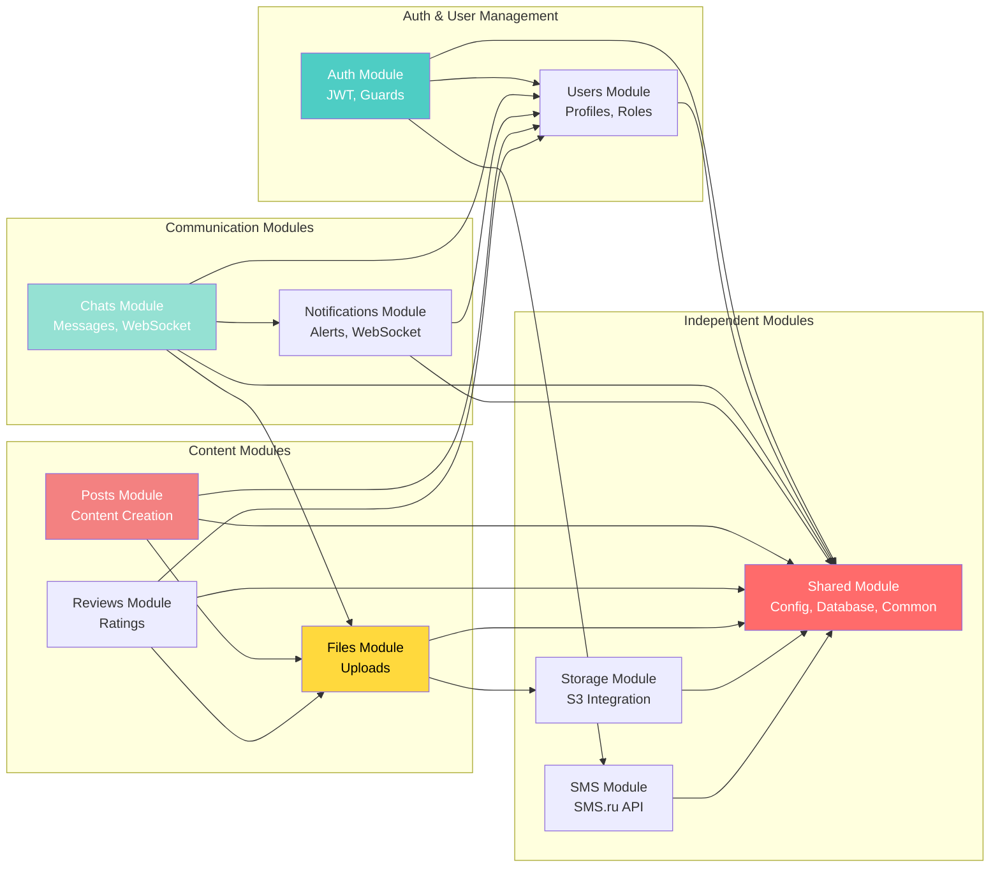
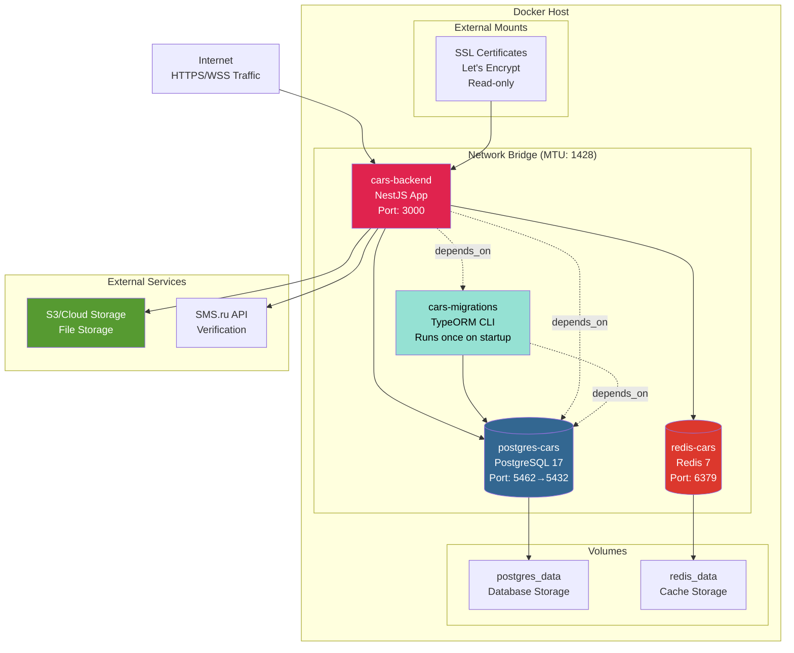

# Cars Backend - Architecture & Component Diagrams

## System Architecture Diagram

This diagram shows the high-level architecture of the Cars Backend system, including external services and infrastructure components.

## Component Architecture Diagram

This diagram shows the internal module structure and dependencies within the NestJS application.

```mermaid
graph TB
    subgraph "Core Modules"
        AppModule[App Module<br/>Root Module]
        SharedModule[Shared Module<br/>Database, Config, Common]
    end

    subgraph "Feature Modules"
        AuthModule[Auth Module<br/>Authentication & JWT]
        UsersModule[Users Module<br/>User Management]
        ChatsModule[Chats Module<br/>Messaging System]
        PostsModule[Posts Module<br/>Content Management]
        ReviewsModule[Reviews Module<br/>Rating System]
        NotificationsModule[Notifications Module<br/>Real-time Alerts]
        FilesModule[Files Module<br/>File Management]
        StorageModule[Storage Module<br/>Cloud Storage]
        SmsModule[SMS Module<br/>Phone Verification]
    end

    subgraph "Module Components"
        direction LR
        Controllers[Controllers<br/>HTTP Endpoints]
        Services[Services<br/>Business Logic]
        Gateways[Gateways<br/>WebSocket Events]
        Guards[Guards<br/>Authorization]
        DTOs[DTOs<br/>Validation]
        Entities[Entities<br/>Database Models]
    end

    AppModule --> SharedModule
    AppModule --> AuthModule
    AppModule --> UsersModule
    AppModule --> ChatsModule
    AppModule --> PostsModule
    AppModule --> ReviewsModule
    AppModule --> NotificationsModule
    AppModule --> FilesModule
    AppModule --> StorageModule
    AppModule --> SmsModule

    AuthModule -.->|uses| UsersModule
    AuthModule -.->|uses| SmsModule
    ChatsModule -.->|uses| UsersModule
    ChatsModule -.->|uses| NotificationsModule
    ChatsModule -.->|uses| FilesModule
    PostsModule -.->|uses| UsersModule
    PostsModule -.->|uses| FilesModule
    ReviewsModule -.->|uses| UsersModule
    ReviewsModule -.->|uses| FilesModule
    NotificationsModule -.->|uses| UsersModule
    FilesModule -.->|uses| StorageModule

    AuthModule --> Controllers
    ChatsModule --> Gateways
    NotificationsModule --> Gateways

    style AppModule fill:#e0234e,color:#fff
    style SharedModule fill:#ff6b6b,color:#fff
    style AuthModule fill:#4ecdc4,color:#fff
    style ChatsModule fill:#95e1d3,color:#fff
    style PostsModule fill:#f38181,color:#fff
```

## Database Entity Relationship Diagram

This diagram shows the database schema and relationships between entities.

## Authentication Flow Diagram

This diagram illustrates the authentication and authorization flow in the application.

## Chat System Flow Diagram

This diagram shows the real-time messaging flow using WebSockets.

## Post Creation & File Upload Flow

This diagram illustrates the process of creating posts with file attachments.

## Module Dependency Graph

This diagram shows the dependencies between different modules in the application.

## Deployment Architecture

This diagram shows the Docker Compose deployment setup.

